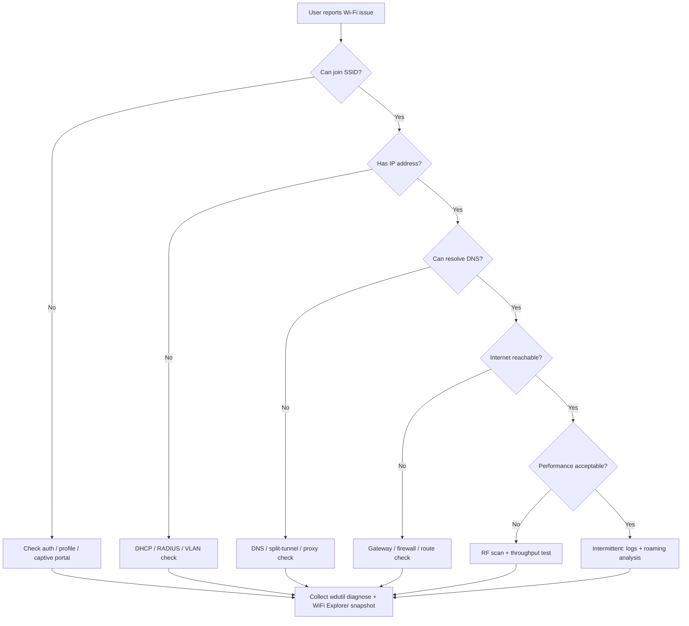

# macOS Wi-Fi Troubleshooting Guide

**Audience:** Help desk, system administrators, and cybersecurity teams  
**Client platform:** macOS (primary)  
**Analysis tools:** WiFi Explorer Pro 3, macOS native utilities, and compatible Linux tooling  
**Official WiFi Explorer documentation:** [WiFi Explorer Pro 3 Help](https://www.intuitibits.com/help/wifiexplorerpro3/)

---

## Purpose

This guide provides a structured workflow for diagnosing Wi-Fi issues from a macOS client. It separates **fast triage** (help desk) from **deeper RF and protocol analysis** (sysadmin / wireless engineering / security), and documents when to escalate to remote Linux sensors or packet capture.

Use this guide when a user reports:

- Cannot connect or frequent disconnects
- Connected but no internet
- Slow throughput or high latency
- Roaming problems between APs
- Suspected interference, rogue APs, or channel overlap
- 802.1X / WPA-Enterprise authentication failures
- 6 GHz discovery or compatibility issues

---

## Tooling Overview

| Layer | Tool | Best for |
|-------|------|----------|
| Triage | macOS Wi-Fi menu (Option-click), `networkQuality`, `ping`, `dig` | Quick client-side checks |
| Diagnostics bundle | Wireless Diagnostics, `wdutil` | Apple-supported evidence for tickets |
| RF / environment | WiFi Explorer Pro 3 | Channel overlap, RSSI/SNR, security, 6 GHz, spectrum |
| Remote / advanced RF | WLAN Pi or Linux sensor + WiFi Explorer | Location-specific scans, 6 GHz, monitor mode |
| Packet / security | Airtool 2, Wireshark, Kismet (Linux sensor) | 802.1X, DHCP, roaming, rogue detection |
| Throughput | `iperf3` (Linux or server) | Isolating Wi-Fi vs upstream bottleneck |

---

## Triage Workflow



### Help desk: first 5 minutes

1. **Confirm scope** — One user, one device, one location, or widespread?
2. **Check association** — Is the Mac connected to the expected SSID?
3. **Check IP** — System Settings → Network → Wi-Fi → Details → TCP/IP
4. **Test reachability:**
   ```bash
   ping -c 5 <default-gateway>
   ping -c 5 1.1.1.1
   dig +short example.com
   networkQuality -c
   ```
5. **Gather Apple diagnostics** (requires admin password):
   ```bash
   sudo wdutil info
   sudo wdutil diagnose
   ```
   The diagnose bundle is written to `/var/tmp` as `WirelessDiagnostics-*.tar.gz`.

6. **Escalate** with: username, device model, macOS version, location, SSID, timestamp, `wdutil info` output, and a WiFi Explorer screenshot or export if available.

---

## macOS Native Tools

### 1. Wi-Fi menu (Option-click)

Hold **Option** and click the Wi-Fi icon in the menu bar to reveal:

- PHY mode, channel, bandwidth, RSSI
- Noise, TX rate, MCS index, NSS (spatial streams)
- Security type
- BSSID of the associated AP

**Use when:** Verifying the client is on the expected AP, band, and channel width without installing software.

**Limitation:** Snapshot only; no historical view or neighbor AP comparison.

### 2. Wireless Diagnostics (GUI)

**Open:** Option-click Wi-Fi menu → **Open Wireless Diagnostics**

| Action | Purpose |
|--------|---------|
| **Scan** (Window → Scan) | Lists nearby SSIDs with RSSI and channel — useful for overlap checks |
| **Performance** | Records connectivity over time |
| **Logs** | Enables Wi-Fi logging for deeper analysis |
| **Info** (Window → Info) | Interface details similar to `wdutil info` |
| **Assistant** | Guided analysis; produces `.tar.gz` report in `/var/tmp` |

**Use when:** Standard Apple-supported workflow; preferred for help desk evidence collection.

**Note:** Wireless Diagnostics does not change network settings.

### 3. `wdutil` (command-line Wireless Diagnostics)

The deprecated `airport` CLI was removed in macOS Sonoma 14.4+. Use `wdutil` instead.

```bash
# Current Wi-Fi environment (RSSI, channel, BSSID, PHY, etc.)
sudo wdutil info

# Full diagnostics bundle (same family as Wireless Diagnostics)
sudo wdutil diagnose
sudo wdutil diagnose -f ~/Desktop

# Enable Wi-Fi subsystem logging
sudo wdutil log +wifi

# Dump Wi-Fi log buffer
sudo wdutil dump

# Disable logging when finished
sudo wdutil log -wifi
```

**Important:** All `wdutil` operations require `sudo`. Plan for admin credentials on help desk calls.

**Use when:** Scriptable collection, remote support sessions, or when GUI access is inconvenient.

### 4. `system_profiler`

```bash
system_profiler SPAirPortDataType
```

Reports hardware capabilities: supported bands (2.4 / 5 / 6 GHz), channels, firmware, and current association.

**Use when:** Confirming whether the Mac supports Wi-Fi 6E/7, or documenting hardware for a ticket.

### 5. `networkQuality`

```bash
networkQuality          # Default test
networkQuality -c       # Compact output
```

Measures **responsive throughput** and **idle latency** (RPM — round-trips per minute). Better than a simple speed test for "Wi-Fi feels slow" complaints because it reflects real-world responsiveness.

**Use when:** Distinguishing Wi-Fi issues from ISP/upstream congestion.

### 6. Standard network utilities

```bash
# Layer 2 / 3 path
ping -c 10 <gateway>
traceroute 1.1.1.1

# DNS
dig @<dns-server> example.com
scutil --dns

# Active connections / listeners
netstat -rn
lsof -i :443

# Live Wi-Fi related logs (macOS Ventura+)
log stream --predicate 'subsystem == "com.apple.wifi"' --level debug
```

### 7. System Settings checks

| Location | Check |
|----------|-------|
| Network → Wi-Fi → Details | IP, router, DNS, 802.1X identity |
| Network → Wi-Fi → Advanced | Preferred networks, auto-join, private MAC per network |
| Privacy & Security → Location Services | Required for accurate Wi-Fi scanning in some tools |
| Profiles | MDM-delivered Wi-Fi or certificate payloads |

### 8. AirPort Utility (iOS) — supplemental scan

Apple's free **AirPort Utility** app on iPhone/iPad can scan nearby networks when **Wi-Fi Scanner** is enabled in iOS Settings → Apps → AirPort Utility. Export results and import into WiFi Explorer Pro 3 for spectrum visualization.

**Use when:** You need a scan from the user's physical location without carrying a laptop.

**Limitation:** CSV export lacks full information elements (no channel width, security details, etc.). Prefer PCAP when possible.

---

## WiFi Explorer Pro 3

WiFi Explorer Pro 3 is the primary professional tool in this guide for RF visualization, multi-band analysis, and structured scan comparison.

**Documentation:** [WiFi Explorer Pro 3 Help](https://www.intuitibits.com/help/wifiexplorerpro3/)  
**Training reference:** [Mastering WiFi Explorer Pro (WLPC 2025)](https://www.intuitibits.com/downloads/resources/Mastering%20WiFi%20Explorer%20Pro%20-%20WLPC%20Phoenix%202025%20-%20Day%201.pdf)

### Scan modes

| Mode | Description | When to use |
|------|-------------|-------------|
| **Active** (default) | Null probe requests across channels | Fast discovery of all SSIDs |
| **Directed** | Probe requests for a specific SSID | Hidden SSID or targeted SSID troubleshooting |
| **Passive (All Channels)** | Monitor mode; listens for beacons | Hidden networks, accurate beacon-only view |
| **Remote sensor** | Scan via WLAN Pi / Linux host | Location-specific scan, 6 GHz, better antenna |

**Passive mode notes:**

- Disconnects the Mac from Wi-Fi during scan
- Not available on Apple silicon M1 models
- Reconnect may require manual re-join after scan stops

### Key views and features

| Feature | Troubleshooting value |
|---------|----------------------|
| **Spectrum (2.4 / 5 / 6 GHz)** | Visual channel overlap, co-channel and adjacent-channel interference |
| **Organization by SSID / AP / Vendor** | Identify multi-AP deployments, rogue vendors, misconfigured SSIDs |
| **Coloring rules & filters** | Highlight open networks, weak signal, overlapping channels, specific vendors |
| **Advanced Details / IE decoder** | WPA version, PMF, MFP, RNR (6 GHz discovery), fast transition (802.11r) |
| **SSID overhead estimation** | Beacon airtime cost in dense environments |
| **Spectrum analyzer integration** | Non-Wi-Fi interference (microwave, BLE, Zigbee) |
| **PCAP import** | Analyze captures from Airtool 2, Aruba Utilities, or Linux `tcpdump` |
| **CSV import** | AirPort Utility (iOS), Analiti (Android) for remote site snapshots |

### Built-in columns (high-value for triage)

Enable via right-click on the networks table header:

| Column | Indicates |
|--------|-----------|
| **Signal (RSSI) / SNR / Noise** | Coverage quality |
| **Channel / Channel Width / Band** | Band steering and width mismatches |
| **Security** | Open vs WPA2/WPA3/Enterprise misconfiguration |
| **Channel Utilization** | Congestion on the serving channel |
| **Stations / Clients** | AP load (passive scan) |
| **Amendments** | 802.11k/v/r support (roaming) |
| **Uptime / Beacon Airtime** | Recently rebooted AP or excessive beacon overhead |
| **Vendor** | Rogue or unexpected hardware |

Columns are grouped **Basic**, **Standard**, **Expert**, and **Legacy** in the application. See Chapter 11 of the WiFi Explorer user guide for full column definitions.

### Remote sensors (Linux)

WiFi Explorer Pro 3 can use a **remote sensor** — typically a [WLAN Pi](https://wlanpi.com/) or any Linux host with a compatible USB Wi-Fi adapter — to scan on behalf of the Mac.

**Setup:**

1. WiFi Explorer Pro 3 → **Settings** → **Sensors** → **+**
2. Enter the sensor's **wired IP address** (not Wi-Fi IP)
3. Configure **Interface** (e.g., `wlan0`) and **Mode** (Active / Passive / Auto)
4. Select the sensor from the toolbar scan mode selector
5. Authenticate via SSH when prompted

**Troubleshooting a sensor:**

1. Settings → Sensors → select sensor → **More (⋯)** → **Run Diagnostics**
2. Diagnostics verify: network reachability, required packages, adapter compatibility
3. Copy output to clipboard for vendor support or internal ticketing

**When to use a remote sensor:**

- User's Mac lacks 6 GHz scan capability
- Scan needed in a wiring closet, classroom, or warehouse without visiting with a laptop
- Passive / monitor-mode capture with a better antenna (e.g., Alfa, Comfast, Intel AX210-based adapters)
- Security team needs site survey evidence from a fixed sensor location

### 6 GHz discovery

6 GHz has unique discovery mechanisms. In WiFi Explorer, inspect **Reduced Neighbor Reports (RNR)** in Advanced Details to find 6 GHz BSSIDs advertised on 2.4/5 GHz beacons. Note **Preferred Scanning Channels (PSC)** — in the US, PSC reduces scan set from 59 to 15 channels (5, 21, 37, 53, 69, 85, 101, 117, 133, 149, 165, 181, 197, 213, 229).

**Use when:** Client supports 6 GHz but cannot see the SSID; verify AP is broadcasting RNR and PSC correctly.

---

## Issue Playbooks

### Cannot connect to SSID

| Step | Action |
|------|--------|
| 1 | Verify SSID visible in WiFi Explorer or Wireless Diagnostics → Scan |
| 2 | Check Security column — WPA3-only SSID on older Mac? |
| 3 | Check for **Private Wi-Fi Address** causing MAC ACL or RADIUS mismatch |
| 4 | For enterprise: verify 802.1X identity, certificate trust, and RADIUS reachability |
| 5 | Collect `sudo wdutil info` and Wi-Fi logs: `sudo wdutil log +wifi` then reproduce |

**Escalate to security / network** when: rogue SSID with same name (compare BSSID and vendor), certificate pinning failures, or EAP method mismatch.

### Connected, no internet

| Step | Action |
|------|--------|
| 1 | Confirm IP assigned (not APIPA `169.254.x.x`) |
| 2 | `ping <gateway>` — if fail: VLAN, ACL, or DHCP scope issue |
| 3 | `ping 1.1.1.1` — if gateway ok but internet fail: routing or firewall |
| 4 | `dig example.com` — if IP works but names fail: DNS |
| 5 | Check proxy/VPN/MDM split-tunnel policies |

### Slow or unstable performance

| Step | Action |
|------|--------|
| 1 | Option-click Wi-Fi — note RSSI (aim for −67 dBm or better for typical enterprise) |
| 2 | WiFi Explorer — check **Channel Utilization**, overlapping APs on same channel |
| 3 | `networkQuality` — compare against known-good baseline |
| 4 | `iperf3` to local server (see Linux tools) — isolate Wi-Fi from WAN |
| 5 | Wireless Diagnostics → Performance — record over 10–30 minutes |
| 6 | Check band — client stuck on 2.4 GHz? Compare RSSI on 5/6 GHz alternatives |

### Frequent disconnects / roaming

| Step | Action |
|------|--------|
| 1 | Option-click Wi-Fi — watch BSSID changes (roaming) |
| 2 | WiFi Explorer — enable **Amendments** column; verify 802.11k/v/r on APs |
| 3 | Check for sticky client on distant AP (high RSSI variance) |
| 4 | Packet capture during roam (Airtool 2 / Linux) for 802.11r FT or EAP re-auth delays |
| 5 | `sudo wdutil log +wifi` and reproduce; review disconnect reason codes |

### Suspected interference

| Step | Action |
|------|--------|
| 1 | WiFi Explorer Spectrum view — non-Wi-Fi occupancy patterns |
| 2 | Connect spectrum analyzer if available (WiFi Explorer integration) |
| 3 | Passive scan on remote sensor for consistent channel utilization |
| 4 | Look for BLE, Zigbee, microwave, or video bridge on 2.4 GHz |

### 6 GHz / Wi-Fi 6E / 7 issues

| Step | Action |
|------|--------|
| 1 | `system_profiler SPAirPortDataType` — confirm 6 GHz supported |
| 2 | WiFi Explorer — inspect RNR from 5 GHz beacons |
| 3 | Verify client profile includes 6 GHz SSID and WPA3 requirements |
| 4 | Use WLAN Pi sensor if Mac adapter lacks reliable 6 GHz scan |

---

## Linux Tools (Compatible & Recommended)

These tools complement the macOS workflow. Several integrate directly with WiFi Explorer Pro 3 or Airtool 2 as remote sensors.

### WLAN Pi (recommended platform)

Purpose-built wireless diagnostic appliance. Preloaded with tools and supported as a WiFi Explorer / Airtool remote sensor.

| Tool | Role |
|------|------|
| **scandump** (sensor backend) | Active scan data for WiFi Explorer |
| **tcpdump / horst** | Passive capture and live frame analysis |
| **Kismet** | IDS, rogue AP detection, distributed sensors |
| **iPerf3** | Throughput testing |
| **bettercap** | Network reconnaissance (authorized assessments only) |

**Docs:** [WLAN Pi Cookbook — WiFi Explorer Pro 3](https://wlanpi.gitbook.io/cookbook/wlan-pi-cookbook/2023-m4/wi-fi-scanner/wi-fi-explorer-pro-3-macos)

### Core Linux Wi-Fi utilities

Install on Ubuntu, Debian, Raspberry Pi OS, or Kali:

```bash
# Adapter and link status
sudo apt install iw wireless-tools
iw dev
iw dev wlan0 link
iw dev wlan0 scan | less

# Live signal monitor (TUI)
sudo apt install wavemon
wavemon

# Throughput (run server on wired host)
sudo apt install iperf3
iperf3 -s
# On Mac client:
iperf3 -c <server-ip> -P 4 -t 30

# Passive capture (monitor mode)
sudo ip link set wlan0 down
sudo iw dev wlan0 set type monitor
sudo ip link set wlan0 up
sudo tcpdump -i wlan0 -w capture.pcapng
```

### Kismet (security / rogue detection)

Distributed wireless IDS. Linux sensors forward captures to a central Kismet server.

**Server** (`kismet.conf` or `kismet_site.conf`):

```
remote_capture_enabled=true
remote_capture_listen=127.0.0.1
remote_capture_port=3501
```

Use SSH tunneling rather than exposing port 3501 broadly.

**Remote sensor:**

```bash
sudo apt install kismet-capture-linux-wifi
kismet_cap_linux_wifi \
  --connect <server-ip>:3501 \
  --source=wlan0:name=floor2-sensor,hop=true,hop_rate=5/sec
```

**Use when:** Rogue AP detection, continuous monitoring, BLE/Wi-Fi correlation, security operations.

### Wireshark / tshark

Open PCAP files captured on Linux or via Airtool 2. Filter examples:

```
wlan.fc.type_subtype == 0x08          # Beacons
wlan.fc.type_subtype == 0x05          # Probe responses
eapol                                 # 802.1X authentication
wlan.sa == <ap-bssid>                 # Specific AP
```

Import PCAP into WiFi Explorer for spectrum-style network tables without full protocol decode.

### Recommended USB adapters (Linux sensors)

| Adapter | Bands | Notes |
|---------|-------|-------|
| **Intel AX210** | 2.4 / 5 / 6 GHz | Tri-band 6E; excellent for 6 GHz surveys |
| **Comfast CF-912AC** (RTL8812AU) | 2.4 / 5 GHz | Common, well-supported for monitor mode |
| **Alfa AWUS036ACHM** | 2.4 / 5 GHz | High gain for distant AP detection |

Verify driver and monitor-mode support before deployment.

### Linux ↔ macOS workflow summary

```
┌─────────────────┐     SSH      ┌──────────────────┐
│  macOS client   │◄────────────►│  WLAN Pi / Linux │
│  WiFi Explorer  │   scan data  │  sensor (wlan0)  │
│  Airtool 2      │              │  tcpdump/Kismet  │
└────────┬────────┘              └────────┬─────────┘
         │                                │
         │  PCAP / CSV import             │  iperf3 server
         ▼                                ▼
   ┌───────────┐                    ┌───────────┐
   │ Wireshark │                    │ Throughput │
   │  analysis │                    │  baseline  │
   └───────────┘                    └───────────┘
```

---

## Cybersecurity Considerations

| Concern | Tool / technique |
|---------|------------------|
| **Rogue AP / evil twin** | WiFi Explorer — compare BSSID, vendor, security; Kismet alerts |
| **Open / weak security** | WiFi Explorer coloring rules for Open, WEP, WPA-TKIP |
| **MAC randomization** | macOS Private Wi-Fi Address — document per-SSID setting |
| **Certificate validation** | 802.1X packet capture — verify server cert chain |
| **Unauthorized bridges** | Kismet distributed sensors, RSSI-based location comparison |
| **Non-Wi-Fi transmitters** | Spectrum analyzer integration |
| **Evidence preservation** | `wdutil diagnose`, PCAP with timestamps, chain-of-custody hash on capture files |

**Operational security:**

- Remote sensors should use SSH keys, not shared passwords
- Restrict Kismet `remote_capture_listen` to localhost; tunnel over SSH
- PCAP files may contain user traffic — handle per organizational data policy
- Document written authorization before passive monitoring in workplace environments

---

## Evidence Collection Checklist

Attach the following to tickets escalated to network / security teams:

- [ ] User, device model, macOS version, location, time window
- [ ] SSID and BSSID (Option-click Wi-Fi or `sudo wdutil info`)
- [ ] `WirelessDiagnostics-*.tar.gz` from `sudo wdutil diagnose`
- [ ] WiFi Explorer screenshot or exported scan (PCAP/CSV)
- [ ] `networkQuality -c` output
- [ ] `ping` / `traceroute` / `dig` results to gateway, IP, and hostname
- [ ] For enterprise auth: sanitized EAPOL capture or RADIUS correlation ID
- [ ] For RF issues: Spectrum view showing channel overlap and serving AP RSSI

---

## Quick Reference Commands

```bash
# === macOS Wi-Fi ===
sudo wdutil info
sudo wdutil diagnose -f ~/Desktop
sudo wdutil log +wifi
sudo wdutil dump
sudo wdutil log -wifi

system_profiler SPAirPortDataType
networkQuality -c

# === Reachability ===
ping -c 5 <gateway>
dig +short example.com
scutil --dns
netstat -rn

# === Linux sensor (SSH) ===
iw dev wlan0 link
iw dev wlan0 scan
sudo tcpdump -i wlan0 -w /tmp/scan.pcapng -c 5000
iperf3 -s

# === Kismet remote sensor ===
kismet_cap_linux_wifi --connect <server>:3501 --source=wlan0:name=site1
```

---

## Escalation Matrix

| Symptom | Help desk action | Escalate to |
|---------|------------------|-------------|
| Single user, wrong password / expired cert | Reset credentials, re-push profile | Identity / PKI |
| Single user, no IP | Gather wdutil bundle | Network (DHCP/DNS) |
| Single user, poor RSSI | WiFi Explorer scan at location | Wireless engineer |
| Multiple users, one AP | Compare BSSID, check AP status | Network operations |
| Multiple users, one floor | Channel utilization / overlap scan | Wireless engineer |
| Suspected rogue SSID | PCAP + Kismet verification | Security operations |
| 802.1X failures | EAPOL capture, RADIUS logs | Security / Identity |
| 6 GHz not visible | RNR/PSC check, sensor scan | Wireless engineer |

---

## References

- [WiFi Explorer Pro 3 Help](https://www.intuitibits.com/help/wifiexplorerpro3/)
- [WiFi Explorer Pro 3 Product Page](https://www.intuitibits.com/products/wifiexplorerpro3/)
- [Mastering WiFi Explorer Pro — WLPC 2025 (PDF)](https://www.intuitibits.com/downloads/resources/Mastering%20WiFi%20Explorer%20Pro%20-%20WLPC%20Phoenix%202025%20-%20Day%201.pdf)
- [Using WLAN Pi as a WiFi Explorer Sensor (Intuitibits)](https://www.intuitibits.com/2019/09/24/wlanpi-as-a-sensor/)
- [Goodbye, airport — wdutil migration (Intuitibits)](https://www.intuitibits.com/2024/03/14/goodbye-airport/)
- [Apple — Use Wireless Diagnostics on Mac](https://support.apple.com/guide/mac-help/use-wireless-diagnostics-mchlf4de377f/mac)
- [WLAN Pi Cookbook — WiFi Explorer Pro 3](https://wlanpi.gitbook.io/cookbook/wlan-pi-cookbook/2023-m4/wi-fi-scanner/wi-fi-explorer-pro-3-macos)
- [Kismet Remote Capture Documentation](https://www.kismetwireless.net/docs/readme/remotecap/remotecap/)
- [wdutil man page](https://keith.github.io/xcode-man-pages/wdutil.8.html)

---

## Document maintenance

| Field | Value |
|-------|-------|
| **Last updated** | July 2026 |
| **macOS tested** | Sonoma / Sequoia (`wdutil`, `networkQuality`) |
| **WiFi Explorer version** | Pro 3 |
| **Review cycle** | Quarterly — verify Apple CLI changes and WiFi Explorer sensor compatibility |
